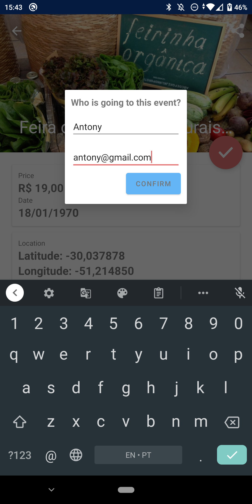

# Events Agenda

## Challenge instructions repository

https://github.com/WoopSicredi/jobs/issues/1

## Synopsis

On this challenge an Android application should be created, accessing data from an API of events and showing details of all events retrieved.

## Requirements

- Kotlin as programming language
- Support SDK 19
- Compile with SDK 29
- Handle API errors

## Download .apk?

[Download APK Link](https://github.com/Leo-Neves/EventsAgenda/releases/tag/v1.0)

## Project development

 The first screen of the app is the event list. It is possible to identify events by name, image and description. When the image is not found, a standard image is displayed to not leave the screen blank.

 When selecting an event the user is redirected to see more details of it, such as the ticket price and description text.

 At the Toolbar, the share button allows you to open the location of the event in a map or transport application.

 

 You can check in at the event by checking the name and email of the person who will be attending.

## Frameworks and libraries

- **Retrofit:** For synchronization with the API, Retrofit was chosen because it automatically parses the JSON response for kotlin objects when integrated with GSON, in addition to being integrated with RxJava.
- **RxJava:** RxJava was chosen to listen to the API responses. Due to its great use in the market, extensive documentation and easy integration with Retrofit, this technology was chosen.
- **Livedata:** Views listen to API responses using livedata. Its advantage is being linked to the activity's lifecycle and having its observer removed whenever the activity dies.
- **Hilt:** Hilt was chosen as a dependency injection to facilitate the instance of dependencies and to allow tests to be made by mocking dependencies.
- **Multidex:** Mandatory use of multidex because the application supports Android API 19 and has more than 65k method references.
- **Picasso:** The Picasso library was chosen to download images through the URL and display them in ImageViews because it is simple to implement, auto-resize the images, manage the cache and handle errors in downloading the images. Some other libs could be used for this, such as UniversalImageLoader (more complex to use) and Fresco (has native C ++ code and needs to split in the .apk before going up in the store to decrease the size of the app in MB).
- **Mockk:** Used in unit tests to mock function returns values.
- **Swipe to refresh:** Make it easier to synchronize the event list by swiping the RecyclerView.
- **ConstraintLayout:** This ViewGroup was chosen because it has high power to position views on the screen without having to nest with several other ViewGroups.
- **CoordinatorLayout:** This ViewGroup helps to define the behaviors of Views in relation to other views. It was used to facilitate the parallax effect.
- **Internacionalização:** The application texts are by default in English but have been internationalized to also appear in Portuguese (depending on the user's default OS language).

## Architecture
  The MVVM architecture pattern was chosen for this project. The Activity classes have the project's View layer definitions and send commands to the ViewModel layer, which responds to View through changes in the state of LiveDatas. ViewModels make calls to the API through UseCase, which are classes used to abstract the interaction with API for a business rule. Each UseCase has only one function, which is to call the Repository who are actually executing the HTTP requests and belongs to the Model layer.

  DTO and BO objects have models that return from the server to the user. DTOs are used by the Repository to send / receive requests. The DTO cannot be manipulated by UseCases, ViewModels, Adapters or Activities, for this purpose we have the BO. After receiving a DTO it is converted to the BO (Business Object) through Mappers. BOs are free to have a customized structure in relation to the DTO and even functions for data validation that make sense in the Views.

## Comments
 - In event list calls there is an Array parameter called people that always has an empty array value. As it is always empty and has no advantage for the app, this attribute was ignored in the DTO.

## In progress
- Images to illustrate the layers of the project architecture in the README.
- Snackbars to replace Toasts in communication with the user.
- Improved layout of the checkin Dialog.

## Future improvements
- Tests with Espresso.
- Increase coverage of unit tests
- Identify the event's city by latitude and longitude using Google's Geocoding API.
