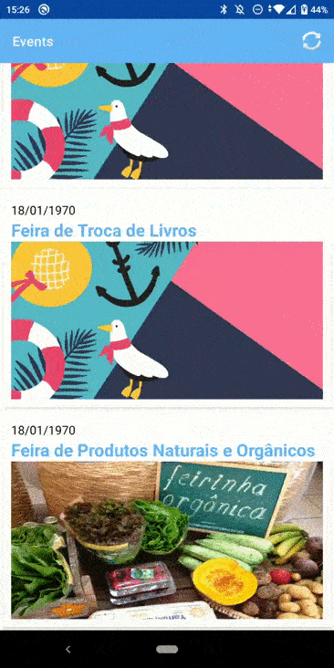
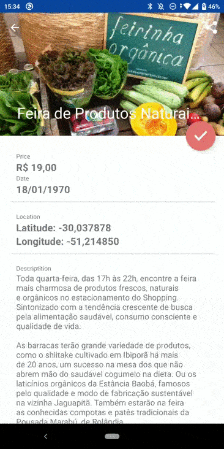
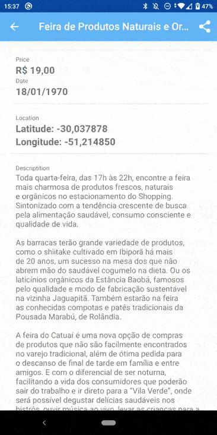
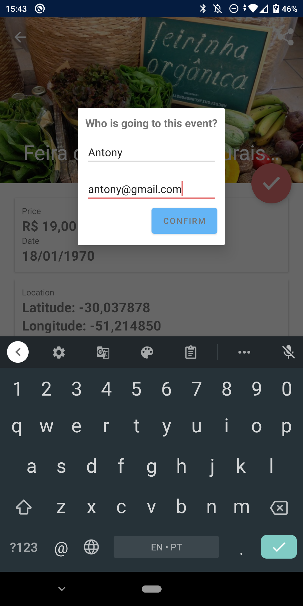

# Events Agenda

## Diretório original

https://github.com/WoopSicredi/jobs/issues/1

## Resumo

Neste desafio, deveria ser criado um aplicativo Android que acessa dados de uma api de eventos e mostre detalhes de todos os eventos.

## Requisitos

- Linguagem Kotlin
- Suporte a API 19
- Compilar com API 29
- Tratamento de erros da API

## Onde baixar

[Download APK](https://github.com/Leo-Neves/EventsAgenda/releases/tag/v1.0)

## Desenvolvimento do projeto

A primeira tela do app é a lista de eventos. É possível identificar eventos pelo nome, imagem e descrição. Quando a imagem não é encontrada é exibido um banner padrão para não deixar a tela em branco.

Ao selecionar um evento o usuário é redirecionado para ver mais detalhes deste, como o preço do ingresso e texto de descrição.

 No cabeçário da tela o botão de compartilhar permite abrir a localização do evento em aplicativo de mapas ou de transporte.

 

 É possível fazer o checkin no evento marcando nome e email da pessoa que estará presente.

## Tecnologias utilizadas

- **Retrofit:** Para sincronização com a API foi escolhido o Retrofit por fazer automaticamente o parser da resposta JSON para objetos kotlin, além de possuir integração com RxJava.
- **RxJava:** RxJava foi escolhido para escutar as respostas da API. Por ter um grande uso no mercado, vasta documentação e fácil integração com Retrofit esta tecnologia foi escolhida.
- **Livedata:** Views escutam as respostas da API utilizando livedata. Sua vantagem é estar vinculado ao ciclo de vida do activity e ter seu observer removido sempre que o activity morre.
- **Hilt:** Hilt foi escolhido como injeção de dependência para facilitar a instância de dependências e possibilitar que testes sejam feitos mockando dependências.
- **Multidex:** Uso obrigatório do multidex devido o aplicativo suportar API 19 do Android e possuir mais de 65k referências a métodos.
- **Picasso:** Para baixar imagens dvia URL e exbil-as em ImageViews foi escolhido a biblioteca Picasso por ser simples de implementar, fazer o auto-redimensionamento das imagens, gerenciar cache e tratar erros de download das imagens. Algumas outras libs poderiam ser usadas para isso, como UniversalImageLoader (mais complexa de utilizar) e Fresco (possui código nativo C++ e necessita de split no .apk antes de subir na loja para diminuir o tamanho do app em MB).
- **Mockk:** Utilizado nos testes unitários para mockar respostas de chamadas das funções.
- **Swipe to refresh:** Facilitar a sincronização da lista de eventos fazendo um swipe no RecyclerView.
- **ConstraintLayout:** Escolhido esse ViewGroup por ter alto poder de posicionar views na tela sem precisar aninhar com vários outros ViewGroups.
- **CoordinatorLayout:** Este ViewGroup ajuda a definir comportamentos das Views em relação a outras views. Foi utilizado para facilitar o efeito parallax.
- **Internacionalização:** Os textos do aplicativo estão por padrão em inglês mas foram internacionalizados para também aparecerem em portugues (dependendo do idioma padrão do SO do usuário).

## Arquitetura
  Foi escolhido o padrão de arquitetura MVVM para este projeto. As classes Activity possuem as definições de view do projeto e mandam comandos para a camada ViewModel, que por sua vez respondem a View através de mudanças no estado de Livedatas. Os ViewModels fazem as chamadas na API através de UseCase, que são classes usadas para abstrair a interação com API para uma regra de negócio. Cada UseCase possui somente uma função que é chamar os Repositories que são quem de fato executa as requisições HTTP.

  Os objetos DTO e BO possuem os models que retornam do servidor para o usuário. Os DTOs são utilizadas pelo Repository para enviar/receber requisições. O DTO não pode ser manipulado pelos UseCases, ViewModels, Adapters ou Activities, para isso temos o BO. Após obtido um DTO este é convertido para BO (Business Object) através dos Mappers. BOs tem liberdade de possuir uma estrutura customizada em relação ao DTO e até funções para validação de dados que façam sentido nas Views.

## Observações
 - Nas chamadas de lista de eventos há um parâmetro do tipo Array chamado people que sempre possui o valor de array vazio. Como ele sempre está vazio e não trouxe vantagens para o app então este atributo foi ignorado no DTO.

## Em progresso
- Figuras para ilustrar as camadas da arquitetura do projeto.
- Snackbars para substituir Toasts na comunicação com usuário.
- Melhoria no layout do Dialog de checkin.

## Melhorias futuras
- Testes com Espresso.
- Aumentar cobertura dos testes unitários
- Identificar cidade do evento por latitude e longitude.
